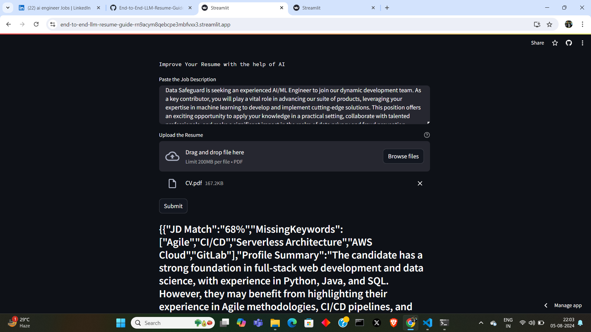

# LLM Resume Guide
End-to-End resume guide which takes the job description you are applying for and your resume in pdf format as inputs and provides insights as to what changes you might need to make in your resume to make it more desirable for the aforementioned job description.

## Libraries used
* protobuf
* PyPDF2==3.0.1
* python-dotenv==1.0.1
* streamlit==1.33.0
* google-generativeai

## Setup
To run first of all, install all the requirements by running the following code on your terminal/command prompt:

```
pip install -r "requirements.txt"
```

After installing all the dependencies all that is left to do is run the app on streamlit using the following code on your terminal/command prompt:
```
streamlit run app.py
```
## The UI
* Enter the details of the desired job description
* Upload your resume in pdf format
* Hit the `Submit` button

